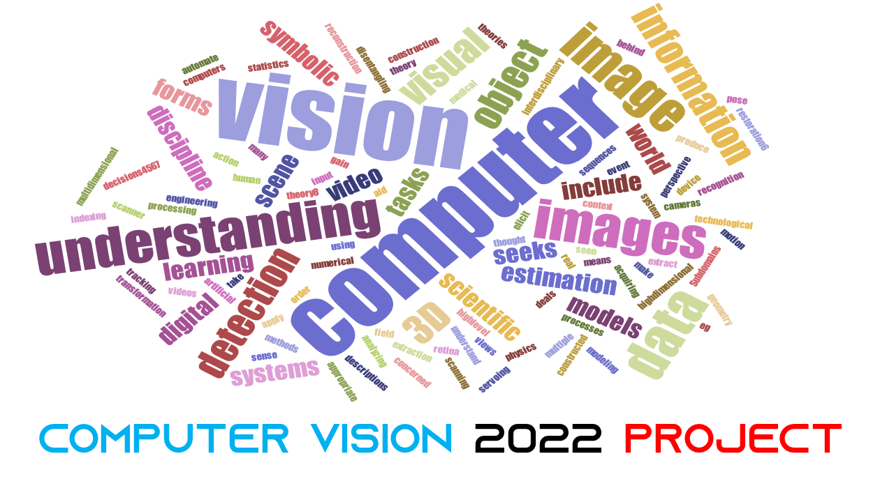

  
  
&nbsp;

  

  <b><a href="https://preminstrel.github.io/computer-vision-2022-project/">Project website</a></b>
    

  
&nbsp;

 

## Log
***2022/3/4*** 

Creation of the repo

Creation of the project website